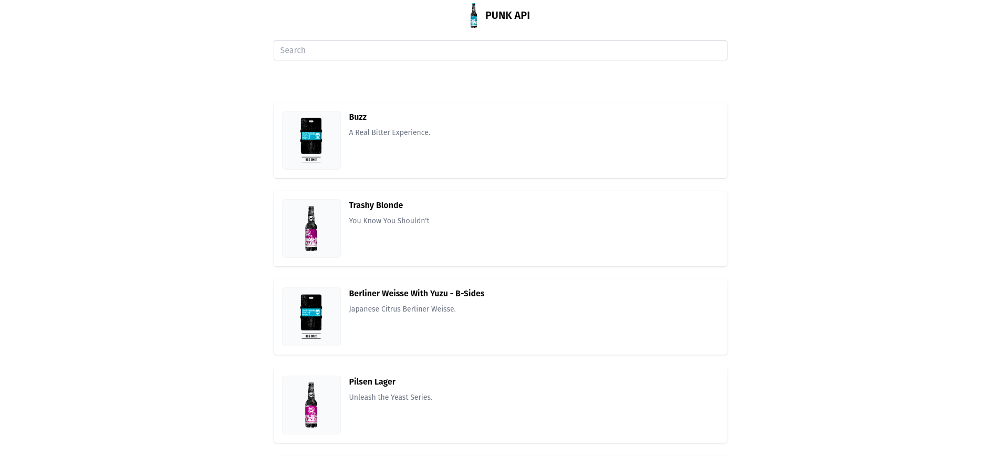

# Beer api

My project is a web page with a search bar that utilizes the Punk API to display beer results based on the search query.



## Getting Started

```bash
# install dependencies
$ npm install

# runs the app in the development mode
$ npm start
```

## Technologies Used

- [React](https://react.dev/)
- [Tailwind CSS](https://tailwindcss.com/)
